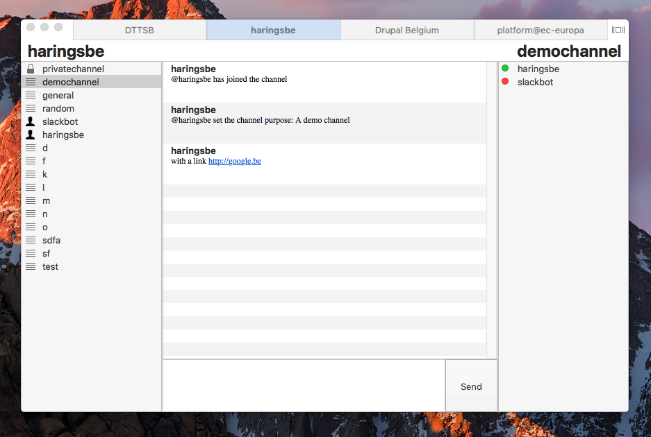
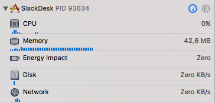

# SlackDesk

An alternative client for Slack written in swift.

## Why?

The official client for me was pretty resource heavy. With around 8 teams active
the memory consumption was above 1GB.

This inspired me, together with my interest in learning a new programming
language to develop a simpler client, natively for os x.

The client is build with the vision of giving as much of the features, but to
keep it from being distractive and resource heavy

Memory usage after launch with 4 connections:

__Disclaimer__

This is my first project I have ever written in Swift. I am pretty sure that many
improvements can be made (and will be made) over time. Feel free to point me to
better implementation techniques if you feel they can improve the client.

Pull requests and bug reports are welcome!

## What works?

- Multiple clients using [legacy tokens](https://api.slack.com/custom-integrations/legacy-tokens)
- Chatting
- Groups, private channels, public channels
- User list with live status
- Links and markdown rendering of messages
- Emoji rendering (most of them)
- Live adding of channels via other clients
- Notification of new messages (without control)

__What does not work__

Many things, but that is the point. I will try to add more features but I will
add them one by one:

- Image viewing
- Drag and drop image uploading
- Snippet viewing
- Channel creation
- Notification manager
- Status manager
- Suggest yours!

If you want a full featured Slack client, you should use the official client.

## Usage

Download the [latest release](slackDesk.app) and copy it to your applications
folder.

Then go and create [legacy tokens](https://api.slack.com/custom-integrations/legacy-tokens)

Last is to add the legacy tokens to the settings pane (CMD+,)

Restart the client for the new connections to be initialized.

## Developing

If you would like to contribute, clone the repository.

As this project is using CocoaPods, you should run `pod install` after cloning.

After running `pod install` open the `SlackDesk.xcworkspace`

All code goes thorough pull requests together with an issue explaining the
motivation for the code.

All help is welcome and much appreciated.

The project has no coverage currently as this was more a POC, all new
development should have coverage.
